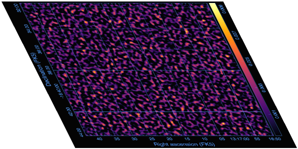
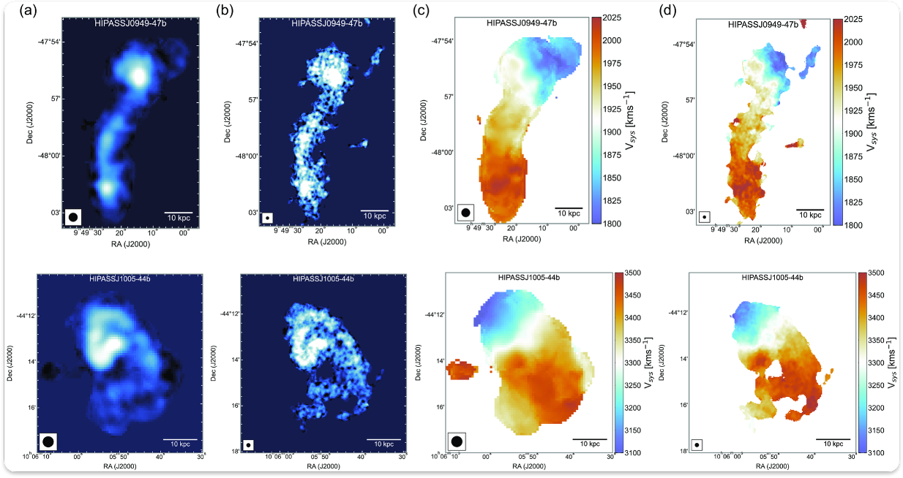
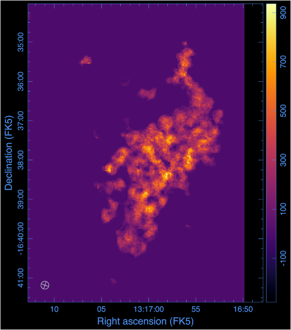
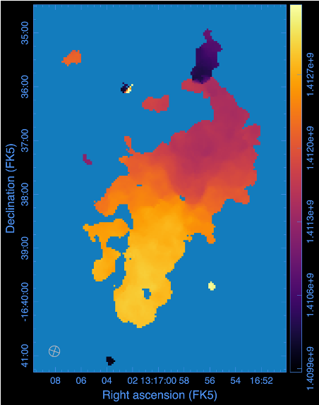
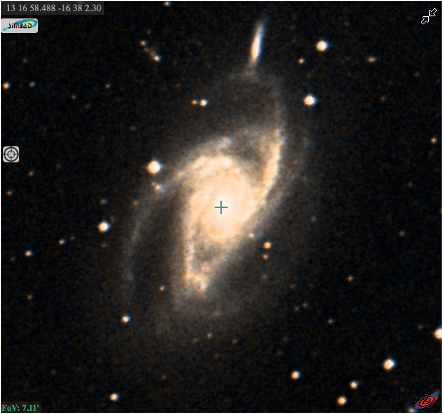
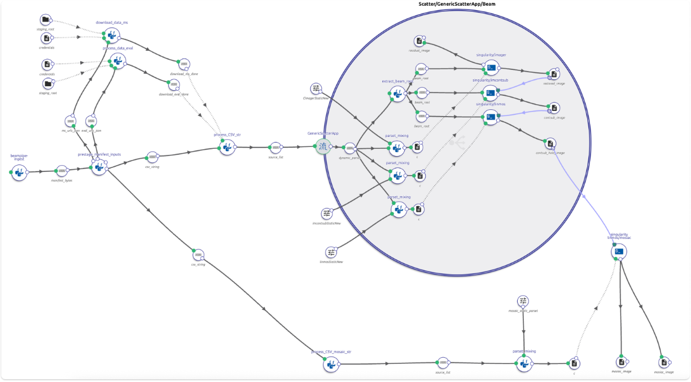
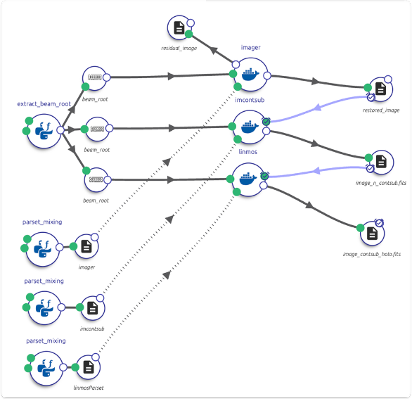

# WALLABY hi-res (Beampipe)

This repository holds the updated **WALLABY high-resolution imaging** [DALiuGE](https://daliuge.readthedocs.io/) workflow and the `wallaby_hires` Python components that build per-beam parsets, stage inputs, and drive [ASKAPsoft](https://www.atnf.csiro.au/computing/software/askapsoft/sdp/docs/current/pipelines/introduction.html) [**cimager**](https://www.atnf.csiro.au/computing/software/askapsoft/sdp/docs/current/calim/cimager.html), [**imcontsub**](https://www.atnf.csiro.au/computing/software/askapsoft/sdp/docs/current/calim/imcontsub.html), and [**linmos**](https://www.atnf.csiro.au/computing/software/askapsoft/sdp/docs/current/calim/linmos.html) on platforms such as the ICRAR Hyades cluster and [Setonix](https://pawsey.org.au/systems/setonix/) at Pawsey.

This is built on the work presented the original [wallaby-hires](https://github.com/jbwod/beampipe-wallaby/tree/main) pipeline.

<p align="center">
  
</p>
<p align="center">
  
</p>

## What it does

> - **`Manifest-driven ingestion`**: accepts a Beampipe execution manifest (staged MS tarballs, evaluation metadata, credentials) and turns it into a per-beam CSV plus download URL lists for the graph.

> - **`Beam-scoped workspace layout`**: unpacks each MS under `{source}/{sbid}/{beamNN}/`, runs imaging in that working directory, and keeps evaluation primary-beam cubes under `{source}/{sbid}/eval/`.

> - **`Dynamic parset generation`**: `process_CSV_str` emits per-row dictionaries (dataset path, field direction, `imcontsub` / `linmos` logical names, beam roots) that `parset_mixing` merges with static ASKAPsoft templates from the graph.

> - **`ASKAPsoft imaging chain`**: per beam - **cimager** → **imcontsub** → **linmos** — then **mosaic** across beams for a source. Final products can be inventoried with SHA-256 evidence and atomically published to a configured durable filesystem.

> - **`Idempotent staging`**: checksum validation, common data-set, skips re-download and re-untar when files or the target `.ms` directory already exist, so retries and partial reruns are safe.

> - **`Test and deploy graphs`**: `*-beampipe.graph` variants are designed to run
> ASKAPsoft in Singularity on Setonix; `*-test-*` graphs replace imager / imcontsub /
> linmos / mosaic with Python stubs for fast local or CI checks.

## WALLABY hi-res imaging overview

- One of the key data products for the full [WALLABY](https://wallaby-survey.org/) survey are the high-resolution **12 arcsec “postage stamps”** for a selected sub-sample of galaxies.
- The sample includes a catalouge of HIPASS galaxies and additional targets chosen from optical properties likely to be well resolve.
- Visibilities include the longest **6 km** baselines (highest achievable resolution) from calibrated, UV continuum-subtracted data produced by the default WALLABY ASKAPsoft imaging pipeline.
- For each source, visibilities are split for up to **three neighbouring beams** (up to **six beams** per source across footprints).
- Each beam uses **~250 channels** over the velocity range where the source is expected.
- Each single-beam dataset is typically **~15 GB**; combined visibility data per source can reach **~90 GB**.
- Split-out datasets per beam are published on [CASDA](https://research.csiro.au/casda/) for processing.

## High-resolution products

Comparison of **moment 0** and **moment 1** maps at **30″** and **12″** for two galaxies (top: HIPASS J0949-047b, bottom: HIPASS J1005-44b). Murugeshan C, Deg N, Westmeier T, et al. *WALLABY Pilot Survey: Public data release of ∼1800 H i sources and high-resolution cut-outs from Pilot Survey Phase 2.*

<p align="center">
  
</p>

Example **data products** produced by the now current `beampipe`-enhanced workflow:

| Moment 0 | Moment 1 | Visualisation |
| :--: | :--: | :--: |
|  |  |  |

## WALLABY hi-res pipeline as a DALiuGE workflow

The earlier hi-res path was a manually invoked script (not under version control) that mostly produced ASKAPsoft configuration files and SLURM jobs. The current pipeline is a **[DALiuGE](https://daliuge.readthedocs.io/)** workflow kept in this repository together with the Python components above.

- Workflows are built and edited with the **[EAGLE](https://eagle-dlg.readthedocs.io/)** graphical editor; sessions can be submitted to a laptop, **Hyades**, or **Setonix**.
- The graph downloads required data from **CASDA** (or consumes Beampipe-staged URLs), prepares ASKAPsoft parameter sets, runs **cimager**, **imcontsub**, and **linmos** per beam, then **mosaics** beam cubes into a single output and weight image.
- Main ASKAPsoft steps use **Docker** or **Singularity** containers (ASKAPsoft team /
  Pawsey images). On Setonix the current graph reads a deployment-managed SIF path
  and bind-mounts the beam directory; the deployment must enforce that SIF's
  immutability.
  
## Pipeline architecture

> Production-shaped processing flow under Beampipe: manifest ⮕ staging ⮕ scatter
> per beam ⮕ imager / imcontsub / linmos ⮕ mosaic ⮕ verified durable publication.
> The terminal publisher comes from the project-neutral `beampipe-palette` package.

<p align="center">
  
</p>

> Original un-modified Graph from wallaby-hires

<p align="center">
  
</p>

**Per-beam imaging** — static cimager / imcontsub / linmos parsets from the graph are merged with dynamic keys from each CSV row (`parset_mixing`).

<p align="center">
  
</p>

### Inputs

**Beampipe / manifest-driven runs**

1. **Manifest** — staged MS and evaluation URLs, optional `credentials_ini_url`, per-source `source_identifier`, `sbid`, catalogue fields (`ra_string`, `dec_string`, `vsys`), evaluation tarball reference.

**Classic legacy-driven runs** (legacy graphs)

1. **Catalogue** — HIPASS sources to process.
2. **Processed catalogue** — already processed sources.
3. **Credentials** — CASDA credentials file.


### FITS naming (dynamic parset)

Logical names (no `.fits` suffix in parsets) follow current cimager / linmos behaviour:

| Stage | Logical name pattern |
|--------|----------------------|
| Cimager image name | `image.<field_id>` |
| Restored cube | `image.restored.<field_id>` |
| After imcontsub | `image.restored.<field_id>.contsub` |
| Linmos holographic output | `image.restored.<field_id>.contsub_holo` |
| Linmos feed offset key | `linmos.feeds.image.restored.<field_id>.contsub` |

`<field_id>` is the MS stem without `.ms` (e.g. `HIPASSJ1317-16_SB72962_F00_B14`).

## DALiuGE graphs

Graphs live under [`dlg-graphs/`](dlg-graphs/). **Prefer `*-beampipe.graph` for production Beampipe runs.**

### Main graphs

| Graph | Description |
|--------|-------------|
| [`wallaby-hires_deploy-pipeline-beampipe.graph`](dlg-graphs/wallaby-hires_deploy-pipeline-beampipe.graph) | Latest **Beampipe deploy** pipeline (ASKAPsoft via Singularity) |
| [`wallaby-hires_deploy-setonix-beampipe.graph`](dlg-graphs/wallaby-hires_deploy-setonix-beampipe.graph) | Setonix-oriented Beampipe deploy variant |
| [`wallaby-hires_test-pipeline-beampipe.graph`](dlg-graphs/wallaby-hires_test-pipeline-beampipe.graph) | Latest **test** graph (ASKAPsoft steps replaced with Python stubs) |
| [`wallaby-hires_test-pipeline-nodownloads-beampipe.graph`](dlg-graphs/wallaby-hires_test-pipeline-nodownloads-beampipe.graph) | Test graph **without download** drops (quick intermediate checks) |
| [`wallaby-hires_deploy-pipeline.graph`](dlg-graphs/wallaby-hires_deploy-pipeline.graph) | Legacy [DEPRECATED] |
| [`wallaby-hires_test-pipeline.graph`](dlg-graphs/wallaby-hires_test-pipeline.graph) | Legacy test pipeline [DEPRECATED] |
| [`wallaby-hires_test-pipeline-nodownloads.graph`](dlg-graphs/wallaby-hires_test-pipeline-nodownloads.graph) | Legacy test pipeline without downloads [DEPRECATED] |


## Python package (`wallaby_hires`)

DALiuGE **PyFunc** entry points (see [`wallaby_hires/__init__.py`](wallaby_hires/__init__.py)):

| Function | Purpose |
|----------|---------|
| `prestage_manifest_inputs` | Manifest to expected credentials path, CSV string, MS/eval URL JSON |
| `download_data_ms` | Download and untar beam MS archives |
| `download_data_eval` | Download and selectively extract evaluation / PB FITS |
| `process_CSV_str` | CSV ⮕ list of per-beam parset dicts |
| `parset_mixing` | Merge static and dynamic parsets to `key=value` text |
| `extract_beam_root` | Resolve per-beam output directory for FileDROP |
| `process_CSV_mosaic_str` | Mosaic-stage dynamic parsets |
| `verify_output_products` | Require non-empty image/weights products and emit SHA-256 evidence |
| `imager` / `imcontsub` / `linmos` / `mosaic` | graph stubs |

Example manifest shape: [`wallaby_hires/test_staging_e2e_manifest.json`](wallaby_hires/test_staging_e2e_manifest.json).
The accepted Beampipe/Core variants and the different no-download contract are
documented in the [manifest contract](docs/manifest-contract.md).

Output verification and the terminal publisher/Core contract are documented in
[`docs/output-integrity.md`](docs/output-integrity.md).

## Installation
Install with the **same interpreter that executes DALiuGE applications**.

```bash
make PYTHON=/daliuge/.venv/bin/python install
```

## Related links

- [WALLABY survey](https://wallaby-survey.org/)
- [ASKAPsoft imaging](https://www.atnf.csiro.au/computing/software/askapsoft/sdp/docs/current/calim/cimager.html)
- [DALiuGE documentation](https://daliuge.readthedocs.io/)
- [CASDA](https://research.csiro.au/casda/)

## License

See [LICENSE](LICENSE).
